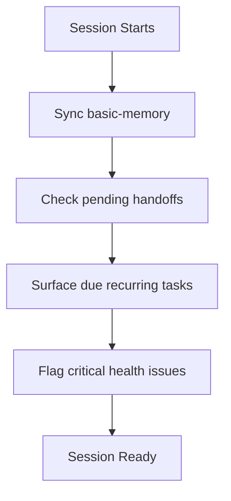

---
tags:
  - "#system"
  - "#instructions"
  - "#automation"
status: active
created_date: 2026-01-03
last_updated: 2026-01-07
---

# Session Start Instructions

## Purpose

Load context and ensure system readiness when a new Claude Code session begins.

## Sequence



## Checks

### 1. Memory Sync
```bash
uvx basic-memory sync
```
Ensure the vault is indexed and searchable.

### 2. Pending Handoffs
- Read `agent-handoff-log.md`
- Surface any handoffs with Status: Pending or In Progress
- Flag handoffs > 24 hours old

### 3. Recurring Tasks Due Today
- Read `recurring-tasks.md`
- Calculate which tasks are due based on current date
- Surface high-priority items

### 4. Vault Health Quick Check
- Check if any project-briefs > 14 days stale
- Check if any contacts > 90 days no interaction
- Flag critical issues only (defer full health check to /health)

## Output

On session start, provide a brief status summary:

```
Session Context Loaded:
- Memory: Synced (X entities indexed)
- Handoffs: Y pending (Z may need attention)
- Due Today: [list of due tasks]
- Health: [ok | warning | critical]
```

## Failure Handling

If any check fails:
1. Log the failure
2. Continue with session (don't block)
3. Surface the issue to user
4. Suggest remediation

---

**Owner:** the Strategic Advisor
**Created:** 2026-01-03
