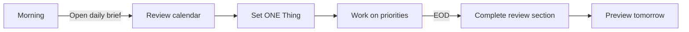
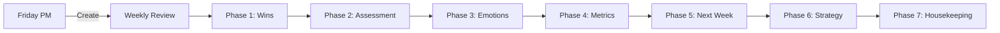
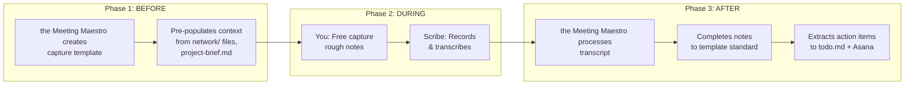

---
tags:
- '#documentation'
- '#templates'
- '#obsidian'
type: documentation
created: 2025-11-26
permalink: templates/readme
---

# 📚 Template System Documentation

> [!tip] Your Personal Operating System Templates
> A comprehensive template system designed for consulting professionals. Built with Templater, Calendar, Buttons, and Meta Bind integration.

---

## 🚀 Quick Start

### How to Use Templates

1. **Command Palette:** `Ctrl/Cmd + P` → "Templater: Insert template"
2. **Hotkey:** Set up hotkeys in Settings → Hotkeys → Search "Templater"
3. **Calendar:** Click a date in the Calendar plugin to auto-create daily briefs
4. **Folder Templates:** Configure Templater to auto-apply templates in specific folders

### Template Naming Convention

All templates use the `tpl-` prefix for easy identification:
- `tpl-daily-brief.md` — Daily planning and review
- `tpl-weekly-review.md` — Weekly reflection and planning
- `tpl-meeting.md` — Meeting notes capture
- etc.

---

## 📋 Template Inventory

### Core Templates

| Template | Purpose | Trigger/Hotkey | Output Location |
|:---------|:--------|:---------------|:----------------|
| `tpl-daily-brief` | Daily strategic planning | Calendar click or manual | `logs/daily/` |
| `tpl-weekly-review` | Weekly reflection | End of week | `logs/weekly/` |
| `tpl-quarterly-review` | Quarterly planning | End of quarter | `logs/quarterly/` |
| `tpl-meeting` | Meeting notes | Before/during meetings | Project folder |
| `tpl-discovery-session` | Client discovery | Discovery calls | Client project folder |

### Project Templates

| Template | Purpose | Trigger | Output Location |
|:---------|:--------|:--------|:----------------|
| `tpl-client-overview` | New client setup | New client engagement | `Projects/Clients/[Client]/` |
| `tpl-project-brief` | New project setup | Project kickoff | `Projects/Clients/[Client]/[Project]/` |
| `tpl-status-report` | Weekly client status report | Friday status emails | Project folder or `logs/weekly/` |

### People Templates

| Template | Purpose | Trigger | Output Location |
|:---------|:--------|:--------|:----------------|
| `tpl-person` | Full contact profile (detailed) | Key network additions | `network/` folder |
| `tpl-person-light` | Lightweight contact profile | Quick adds, bulk migration | `network/` folder |

---

## 📁 Snippets

Quick-insert fragments for use within documents:

| Snippet | Purpose | Usage |
|:--------|:--------|:------|
| `update-timestamp` | Update "Last Updated" field | End of document edits |
| `quick-action` | Add prioritized action item | Action item capture |
| `quick-meeting-capture` | Fast meeting note | During calls |
| `callout` | Insert styled callout | Highlighting content |
| `decision-log-entry` | Log a decision | Decision tracking |
| `standup` | Standup update format | Daily standups |
| `time-entry` | Quick time log | Time tracking |
| `risk-issue-entry` | Log risk or issue | Risk management |

---

## ⚙️ Template Features

### 🗓️ Smart Date Handling

All templates automatically:
- Generate appropriate dates based on context
- Create navigation links to adjacent days/weeks
- Calculate remaining time in month/quarter
- Show contextual alerts for deadlines

### 📊 Meta Bind Integration

Templates include interactive elements:
```markdown
```meta-bind
INPUT[slider(minValue(1), maxValue(5)):dayRating]
```
```

Use these to:
- Rate days/weeks/quarters
- Track energy levels
- Update health indicators
- Toggle statuses

### 🔘 Buttons Plugin Integration

Templates include action buttons:
```markdown
```button
name 📋 Copy Actions to Todo
type command
action Templater: Insert templates/snippets/copy-actions-to-todo.md
```
```

### 🔗 Automatic Linking

Templates automatically:
- Create backlinks to related documents
- Generate wiki-links for attendees
- Link to client/project overviews
- Include navigation to todo/roadmap/network

### 📝 YAML Frontmatter

All templates include comprehensive frontmatter:
- Consistent tagging structure
- Queryable metadata (client, project, status, dates)
- DataView-compatible fields
- Smart Connections integration

---

## 🛠️ Templater Configuration

### Recommended Settings

1. **Settings → Templater → Template folder location:** `templates`

2. **Folder Templates:** Configure auto-templates for folders:
   ```
   logs/daily/ → tpl-daily-brief
   logs/weekly/ → tpl-weekly-review
   ```

3. **Trigger on new file creation:** Enable for auto-prompts

4. **Hotkeys (suggested):**
   - `Alt+D` → Insert tpl-daily-brief
   - `Alt+M` → Insert tpl-meeting
   - `Alt+W` → Insert tpl-weekly-review

### Calendar Integration

The Calendar plugin uses the **core Daily Notes plugin** settings. Configure both:

**1. Core Daily Notes Plugin** (Settings → Core plugins → Daily notes):
- **Date format:** `YYYY-MM-DD-[daily-brief]`
- **New file location:** `logs/daily`
- **Template file location:** `templates/tpl-daily-brief`

**2. Calendar Plugin** (Settings → Calendar):
- No special settings needed — it reads from Daily Notes config
- **Show week numbers:** Enable for weekly review links

> [!warning] Important
> The Calendar plugin doesn't have its own template settings. It uses whatever is configured in the core Daily Notes plugin.

---

## 📐 Template Anatomy

### Standard Structure

Every template follows this pattern:

```markdown
<%* 
// Templater logic block
// - Date calculations
// - User prompts
// - Variable definitions
-%>
---
YAML Frontmatter
---

# Title with Emoji

> [!nav] Navigation links

**See also:** [[backlinks]]

---

## Main Sections

### Subsections with tables, callouts, etc.

---

**Created:** timestamp
**Last Updated:** timestamp

[//begin]: # "Link references"
```

### Key Design Principles

1. **Progressive Disclosure:** Important info first, details in collapsible sections
2. **Visual Hierarchy:** Emojis, callouts, and formatting for scannability
3. **Actionable Structure:** Clear action items, decisions, follow-ups
4. **Context Preservation:** Rich metadata for future reference
5. **Integration Ready:** DataView queries, Smart Connections, Calendar

---

## 🎯 Usage Workflows

### Daily Workflow



### Weekly Workflow



### Meeting Workflow (Three-Phase with Scribe)

This vault uses a **three-phase meeting workflow** that integrates the Meeting Maestro (AI agent) with Scribe (transcription plugin):



| Phase | Who | What Happens |
|-------|-----|--------------|
| **1. Before** | the Meeting Maestro | Creates capture template, pre-populates with attendee context, project background, previous meeting history |
| **2. During** | You | Take free-form notes in the template; records meeting with Scribe plugin |
| **3. After** | the Meeting Maestro | Processes transcript + rough notes → polished meeting notes with decisions, action items, and executive summary |

**Why this workflow works:**
- **Structure without constraint** — Focus on the conversation, not formatting
- **Context preservation** — Nothing gets lost between phases
- **Quality output** — Every meeting produces decision-enabling documentation

**Invocation:**
- "Prep me for my 2pm meeting" → Phase 1
- "Here's the transcript" / "Complete the notes" → Phase 3

> [!tip] Scribe Integration
> Scribe is an Obsidian plugin that records and transcribes meetings. The transcript becomes the source of truth for Phase 3 processing. the Meeting Maestro reconciles your free capture notes with the transcript to produce comprehensive meeting documentation.

> [!info] Full Workflow Details
> See `.claude/agents/meeting-maestro.md` for complete workflow specifications and the Meeting Maestro's processing standards.

---

## 🔧 Customization

### Adding New Templates

1. Create file in `templates/` with `tpl-` prefix
2. Add Templater logic block at top
3. Include standard YAML frontmatter
4. Add navigation and backlinks
5. Document in this file

### Modifying Existing Templates

Templates are designed to be customized. Common modifications:
- Add/remove sections based on your workflow
- Adjust metadata fields for your tracking needs
- Modify prompts and default values
- Add new Meta Bind interactive elements

### Creating Snippets

1. Add to `templates/snippets/`
2. Use Templater syntax for interactivity
3. Keep focused on single purpose
4. Document usage in this file

---

## 📊 DataView Integration

Templates are designed to work with DataView queries:

```dataview
TABLE 
  date as "Date",
  energy as "Energy",
  dayRating as "Rating"
FROM "logs/daily"
WHERE type = "daily-brief"
SORT date DESC
LIMIT 7
```

```dataview
TABLE
  client,
  health,
  last_engagement
FROM "Projects/Clients"
WHERE type = "client-overview"
SORT last_engagement DESC
```

---

## 🚨 Troubleshooting

### Template Not Rendering

1. Check Templater is enabled
2. Verify template folder is set correctly
3. Look for syntax errors in `<%* %>` blocks
4. Check console for error messages

### Prompts Not Appearing

1. Ensure "Trigger on file creation" is enabled
2. Check if using `tp.system.prompt()` correctly
3. Verify async/await syntax

### Calendar Integration Issues

1. Verify Calendar plugin installed and enabled
2. Check template path in Calendar settings
3. Ensure date format matches template expectations

---

## 📚 Resources

- [Templater Documentation](https://silentvoid13.github.io/Templater/)
- [Obsidian Calendar Plugin](https://github.com/liamcain/obsidian-calendar-plugin)
- [Meta Bind Plugin](https://github.com/mProjectsCode/obsidian-meta-bind-plugin)
- [Buttons Plugin](https://github.com/shabegom/buttons)

---

**Created:** 2025-11-26
**Version:** 1.0
**Author:** Your Name + AI Assistant

> [!quote] "A good template is invisible — it gets out of your way and lets you do your best work."