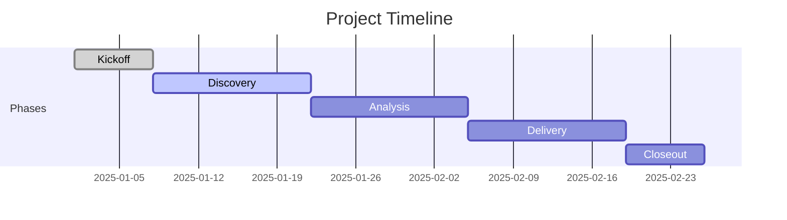

---
tags:
  - "#project"
  - "#assessment"
  - "#example-client"
type: project-brief
client: Example Client
project: Project 1
project_type: assessment
status: active
health: 🟢
start_date: 2025-01-01
target_end: 2025-03-31
actual_end:
project_lead: Your Name
budget_hours: 100
hours_used: 0
budget_remaining: 100
created: 2025-01-01 09:00
last_updated: 2025-01-01 09:00
---

# 📋 Project 1

> [!info] Project Snapshot
> **Client:** [[../client-overview|Example Client]]
> **Type:** Assessment
> **Duration:** 13 weeks (2025-01-01 → 2025-03-31)
> **Lead:** Your Name
> **Health:** 🟢 On Track

**See also:** [[../client-overview]], [[../../../todo]], [[../../../roadmap]]

---

## 🎯 Project Overview

### Objective

> [!tip] What are we trying to accomplish?

[Example: Assess current state of client's technology infrastructure and provide recommendations for modernization.]

### Success Criteria

> [!success] How will we know we've succeeded?

1. [ ] Complete infrastructure assessment document
2. [ ] Deliver prioritized recommendations
3. [ ] Present findings to executive team

### Out of Scope

> [!warning] What are we explicitly NOT doing?

- Implementation of recommendations (separate engagement)
- Security audit (handled by separate team)

---

## 📊 Status Dashboard

### Overall Health

🟢 On Track

### Key Metrics

| Metric | Current | Target | Status |
|:-------|--------:|-------:|:------:|
| Hours Used | 0 | 100 | 🟢 |
| Budget Used | 0% | 100% | 🟢 |
| Timeline | Week 0 | Week 13 | 🟢 |
| Deliverables | 0/3 | 100% | 🟢 |

### Progress Visualization

```
Timeline:   [░░░░░░░░░░░░░░░░░░░░] 0%
Budget:     [░░░░░░░░░░░░░░░░░░░░] 0%
Scope:      [░░░░░░░░░░░░░░░░░░░░] 0%
```

---

## 📅 Timeline & Milestones



### Key Milestones

| Milestone | Target Date | Actual | Status |
|:----------|:------------|:-------|:------:|
| Kickoff Complete | 2025-01-01 |  | ⬜ |
| Discovery Complete |  |  | ⬜ |
| Draft Deliverables |  |  | ⬜ |
| Final Delivery | 2025-03-31 |  | ⬜ |

---

## 📦 Deliverables

### Committed Deliverables

| Deliverable | Description | Due Date | Status |
|:------------|:------------|:---------|:------:|
| Assessment Report | Current state analysis | 2025-02-28 | ⬜ Not Started |
| Recommendations Deck | Prioritized roadmap | 2025-03-15 | ⬜ Not Started |
| Executive Presentation | Final readout | 2025-03-31 | ⬜ Not Started |

### Status Key
- ⬜ Not Started
- 🔄 In Progress
- 📝 In Review
- ✅ Complete
- ❌ Blocked

---

## 👥 Team & Stakeholders

### Project Team (your organization)

| Role | Name | Allocation | Responsibilities |
|:-----|:-----|:-----------|:-----------------|
| Project Lead | Your Name | 50% | Overall delivery |
|  |  |  |  |

### Client Stakeholders

| Role | Name | Email | Decision Authority |
|:-----|:-----|:------|:------------------|
| Executive Sponsor |  |  | Budget, Strategy |
| Project Owner |  |  | Scope, Priorities |
| Technical Lead |  |  | Technical decisions |

---

## ⚠️ Risks & Issues

### Active Risks

| Risk | Likelihood | Impact | Mitigation | Owner |
|:-----|:-----------|:-------|:-----------|:------|
| Resource availability | M | M | Early scheduling | Your Name |

### Active Issues

| Issue | Impact | Status | Owner | Target Resolution |
|:------|:-------|:-------|:------|:------------------|
|  |  | 🔴 Open |  |  |

---

## 📝 Decisions Log

| Date | Decision | Rationale | Made By | Impact |
|:-----|:---------|:----------|:--------|:-------|
| 2025-01-01 | Project kickoff | N/A | Your Name | Baseline |

---

## 💬 Communication Plan

### Status Updates

| Audience | Format | Frequency | Owner |
|:---------|:-------|:----------|:------|
| Client PM | Email | Weekly | Your Name |
| Executive Sponsor | Summary | Bi-weekly | Your Name |

### Key Meetings

| Meeting | Attendees | Cadence | Day/Time |
|:--------|:----------|:--------|:---------|
| Status Call |  | Weekly |  |

---

## 💰 Budget & Time

### Hours Summary

| Category | Budgeted | Used | Remaining | % Used |
|:---------|:--------:|:----:|:---------:|:------:|
| Discovery | 30 | 0 | 30 | 0% |
| Analysis | 40 | 0 | 40 | 0% |
| Delivery | 20 | 0 | 20 | 0% |
| PM/Admin | 10 | 0 | 10 | 0% |
| **Total** | **100** | **0** | **100** | **0%** |

---

## ✅ Action Items

### Open Actions

| Action | Owner | Due | Priority | Status |
|:-------|:------|:----|:--------:|:------:|
|  |  |  | 🔴/🟡/🟢 | ⬜ |

### Waiting On Client

| Item | Who | Since | Impact |
|:-----|:----|:------|:-------|
|  |  |  |  |

---

## 📎 Resources & Links

### Internal Documents

- [[meetings/meeting_notes/]] - All meeting notes
- [[project_TODO]] - Project task list

---

## 📓 Project Journal

### Latest Updates

> **2025-01-01** — Project initiated

---

**Created:** 2025-01-01 09:00
**Last Updated:** 2025-01-01 09:00
**Next Review:** Weekly

[//begin]: # "Autogenerated link references for markdown compatibility"
[../client-overview]: ../client-overview.md "Client Overview"
[../../../todo]: ../../../todo.md "Todo"
[../../../roadmap]: ../../../roadmap.md "Roadmap"
[//end]: # "Autogenerated link references"
